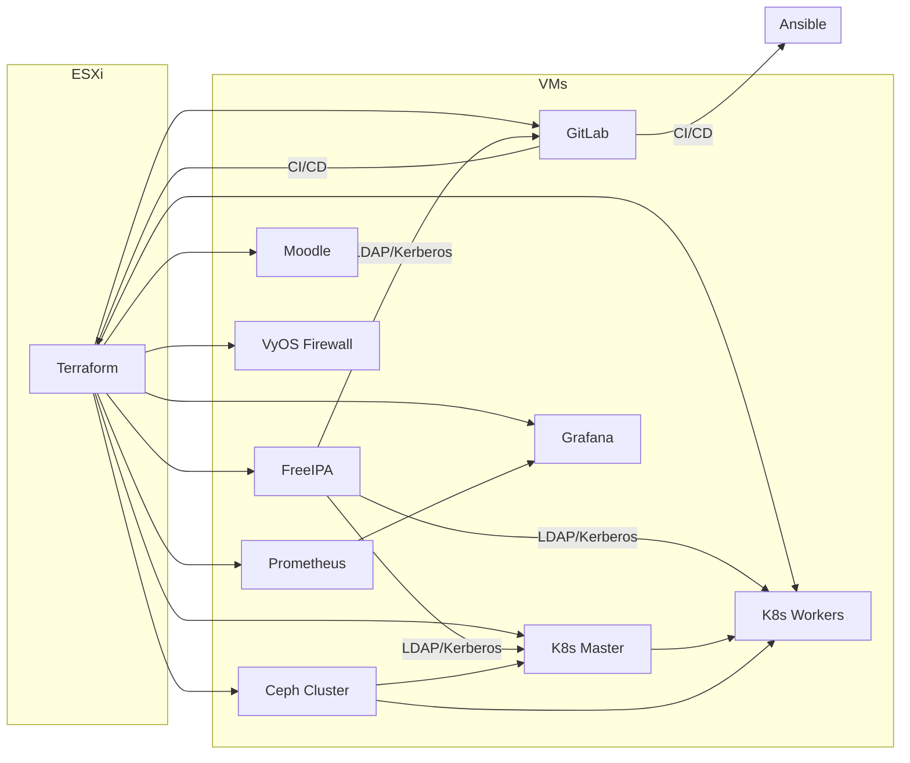

# Руководство разработчика

**Цель:** дать полное представление о DevOps-инфраструктуре ООО «Xsoft», показать, какие части разворачиваются с помощью Terraform, какие настраиваются через Ansible, и как всё работает вместе.

---

## Содержание

1. [Обзор инфраструктуры](#%D0%BE%D0%B1%D0%B7%D0%BE%D1%80-%D0%B8%D0%BD%D1%84%D1%80%D0%B0%D1%81%D1%82%D1%80%D1%83%D0%BA%D1%82%D1%83%D1%80%D1%8B)
2. [Архитектурная схема](#%D0%B0%D1%80%D1%85%D0%B8%D1%82%D0%B5%D0%BA%D1%82%D1%83%D1%80%D0%BD%D0%B0%D1%8F-%D1%81%D1%85%D0%B5%D0%BC%D0%B0)
3. [Компоненты инфраструктуры](#%D0%BA%D0%BE%D0%BC%D0%BF%D0%BE%D0%BD%D0%B5%D0%BD%D1%82%D1%8B-%D0%B8%D0%BD%D1%84%D1%80%D0%B0%D1%81%D1%82%D1%80%D1%83%D0%BA%D1%82%D1%83%D1%80%D1%8B)
4. [Подготовка окружения](#%D0%BF%D0%BE%D0%B4%D0%B3%D0%BE%D1%82%D0%BE%D0%B2%D0%BA%D0%B0-%D0%BE%D0%BA%D1%80%D1%83%D0%B6%D0%B5%D0%BD%D0%B8%D1%8F)
5. [Развёртывание через Terraform](#%D1%80%D0%B0%D0%B7%D0%B2%D1%91%D1%80%D1%82%D1%8B%D0%B2%D0%B0%D0%BD%D0%B8%D0%B5-%D1%87%D0%B5%D1%80%D0%B5%D0%B7-terraform)
6. [Настройка через Ansible](#%D0%BD%D0%B0%D1%81%D1%82%D1%80%D0%BE%D0%B9%D0%BA%D0%B0-%D1%87%D0%B5%D1%80%D0%B5%D0%B7-ansible)
7. [Как добавлять новые сервисы](#%D0%BA%D0%B0%D0%BA-%D0%B4%D0%BE%D0%B1%D0%B0%D0%B2%D0%BB%D1%8F%D1%82%D1%8C-%D0%BD%D0%BE%D0%B2%D1%8B%D0%B5-%D1%81%D0%B5%D1%80%D0%B2%D0%B8%D1%81%D1%8B)
8. [Ответы на частые вопросы](#%D0%BE%D1%82%D0%B2%D0%B5%D1%82%D1%8B-%D0%BD%D0%B0-%D1%87%D0%B0%D1%81%D1%82%D1%8B%D0%B5-%D0%B2%D0%BE%D0%BF%D1%80%D0%BE%D1%81%D1%8B)

---

## Обзор инфраструктуры

* **Terraform**: создаёт виртуальные машины на ESXi (центральный датацентр).
* **Ansible**: внутри созданных ВМ настраивает сервисы (FreeIPA, GitLab, Kubernetes, Ceph, Prometheus, Grafana, Moodle, VyOS).
* **Отделение ролей**: роль в Ansible отвечает за один сервис, переменные лежат в `roles/<rolename>/defaults/main.yml`.

---

## Архитектурная схема



*Схема показывает создание машин через Terraform и настройку их через Ansible.*

---

## Компоненты инфраструктуры

| Сервис     | Описание                                |
| ---------- | --------------------------------------- |
| FreeIPA    | LDAP+Kerberos для единой аутентификации |
| GitLab CE  | Репозитории, CI/CD                      |
| Kubernetes | Контейнерная платформа (Calico CNI)     |
| Ceph       | Распределённое хранилище                |
| Prometheus | Сбор метрик                             |
| Grafana    | Дашборды                                |
| Moodle     | Платформа для тестирования DevOps-цикла |
| VyOS       | Маршрутизатор/Firewall                  |

---

## Подготовка окружения

1. **Установить зависимости** на машине-управлении:

   ```bash
   sudo apt update
   sudo apt install -y curl gnupg software-properties-common python3-venv
   ```
2. **Terraform**:

   ```bash
   curl -fsSL https://apt.releases.hashicorp.com/gpg | sudo apt-key add -
   sudo apt-add-repository "deb [arch=amd64] https://apt.releases.hashicorp.com $(lsb_release -cs) main"
   sudo apt update && sudo apt install -y terraform
   ```
3. **Ansible**:

   ```bash
   sudo apt install -y ansible
   ansible-galaxy collection install community.general community.vmware kubernetes.core
   ```

---

## Развёртывание через Terraform

```bash
cd terraform/
# Скопировать variables.tfvars.example → variables.tfvars и заполнить
terraform init
terraform plan
terraform apply -auto-approve
```

> Результат: создан пул виртуальных машин в ESXi, получаем их IP через `terraform output vm_ips`.

---

## Настройка через Ansible

```bash
cd ../ansible/
# При необходимости скорректировать inventory.ini и group_vars
ansible-playbook playbooks/site.yml
```

* **FreeIPA** устанавливается первым (для единой аутентификации).
* Далее **GitLab**, **Kubernetes**, **Ceph**, **Prometheus**, **Grafana**, **Moodle** и **VyOS**.

---

## Как добавлять новые сервисы

1. Создайте новую роль: `ansible/roles/<servicename>/defaults`, `tasks`, `templates`.
2. Опишите `defaults/main.yml` с переменными.
3. Реализуйте `tasks/main.yml` с шагами установки/настройки.
4. Добавьте блок в `playbooks/site.yml` после соответствующего места.

---

## Ответы на частые вопросы

* **Q:** Где хранить секреты?
  **A:** В Ansible Vault или внешнем хранилище.
* **Q:** Как изменить версию Kubernetes?
  **A:** В `group_vars/k8s.yml` или `roles/k8s/defaults/main.yml`.
* **Q:** Можно ли тестировать Ansible локально?
  **A:** Да, через `Vagrant` или `Docker` контейнеры.

---

> Документ поможет даже начинающему понять, как и где развёртывается инфраструктура и как в неё вносить изменения. Удачи в разработке!
